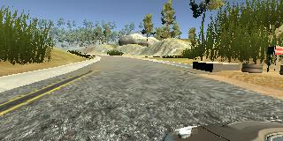
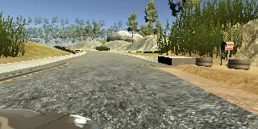

# **Behavioral Cloning** 

My project includes the following files:
* model.py - the script to create and train the model
* drive.py - for driving the car in autonomous mode (from the project's [repo](https://github.com/udacity/CarND-Behavioral-Cloning-P3))
* model.h5 - Keras convolution neural network model
* README.md - summarizing the results

To drive the car autonomously, run 
```
python drive.py model.h5
```
after the [simulator](https://github.com/udacity/self-driving-car-sim) is started.

To train the model, run
```
python model.py
```
after the [sample](https://d17h27t6h515a5.cloudfront.net/topher/2016/December/584f6edd_data/data.zip) training data and [additional](http://web.ics.purdue.edu/~epeng/test2.tgz) training data are unpacked. 

### Model Architecture and Training Strategy

I follow Paul Heraty's [advice](https://slack-files.com/T2HQV035L-F50B85JSX-7d8737aeeb) to use Nvidia’s CNN [model](https://arxiv.org/pdf/1604.07316v1.pdf), which consists of 5 convolutional layers (three 5x5 and two 3x3, depth 24, 36, 48, 64, 64) and 3 fully-connected layers (size 100, 50, 10).

| Layer (type)                    | Output Shape         | Param #    | Connected to            |       
|:-------------------------------:|:--------------------:|:----------:|:-----------------------:|
| cropping2d_1 (Cropping2D)       | (None, 80, 320, 3)   | 0          | cropping2d_input_2[0][0]|
| lambda_1 (Lambda)               | (None, 80, 320, 3)   | 0          | cropping2d_1[0][0]      |
| convolution2d_1 (Convolution2D) | (None, 38, 158, 24)  | 1824       | lambda_1[0][0]          |
| convolution2d_2 (Convolution2D) | (None, 17, 77, 36)   | 21636      | convolution2d_1[0][0]   |   
| convolution2d_3 (Convolution2D) | (None, 7, 37, 48)    | 43248      | convolution2d_2[0][0]   |   
| convolution2d_4 (Convolution2D) | (None, 3, 18, 64)    | 27712      | convolution2d_3[0][0]   |   
| convolution2d_5 (Convolution2D) | (None, 1, 8, 64)     | 36928      | convolution2d_4[0][0]   |   
| flatten_1 (Flatten)             | (None, 512)          | 0          | convolution2d_5[0][0]   |
| dense_1 (Dense)                 | (None, 100)          | 51300      | flatten_1[0][0]         |   
| dropout_1 (Dropout)             | (None, 100)          | 0          | dense_1[0][0]           |   
| activation_1 (Activation)       | (None, 100)          | 0          | dropout_1[0][0]         |   
| dense_2 (Dense)                 | (None, 50)           | 5050       | activation_1[0][0]      |   
| dropout_2 (Dropout)             | (None, 50)           | 0          | dense_2[0][0]           |   
| activation_2 (Activation)       | (None, 50)           | 0          | dropout_2[0][0]         |   
| dense_3 (Dense)                 | (None, 10)           | 510        | activation_2[0][0]      |   
| dropout_3 (Dropout)             | (None, 10)           | 0          | dense_3[0][0]           |   
| activation_3 (Activation)       | (None, 10)           | 0          | dropout_3[0][0]         |   
| dense_4 (Dense)                 | (None, 1)            | 11         | activation_3[0][0]      |   

Total params: 188,219

Images are cropped and normalized (see Sections 9 and 13 of the course material) within the model. I did not add pooling after the convolution (like what we used to do in LeNet) because max pooling was quite time consuming.  I simply use 2x2 stride to reduce the number of parameters. Three dropout layers are added after the three connected layers to reduce overfitting. I started from one dropout layer, but it was not effective. After trying different values by hands, I’m set with dropout rate 0.5, 0.3, and 0.3. The loss function is the mean squared error of the steering angle, which penalizes outlier harshly, so that the car will stay on the track. The loss function is minimized by Adam optimizer. The model will train for a few epochs until the validation loss stops improving using _EarlyStopping_ callback function.

The training data is mainly from the provided Track 1 sample data. I later added two laps of keyboard controlled Track 1 data.  20% of the data are reserved for the validation. Center, left and right cameras are all used to teach the car to drive (details in the next section). 


### Architecture and Training Documentation
I first tried training the central camera data from the sample data. There are 8036 images. Flipping the images (driving clockwise) doubles the amount of the data. The car was able to drive smoothly initially, but it went to a dirt road and crashed.

<table>
  <tr>
    <td><br>version 1</br><br>training loss: 0.0100</br>validation loss: 0.0094</td>
    <td><a href="http://www.youtube.com/watch?feature=player_embedded&v=j5pJNoAC-38" target="_blank"></a></td>
  </tr>
</table>

Then I added data from the left and right camera, with left image having a larger turn and right one a smaller turn (see Section 12 of the course material). This adjustment to the nominal steering angle is a hyperparameter.

|||
|:---:|:---:|
|left|right|

The total size of the training and validation set is now 8036x2x3 = 48k. The car can finish 1 lap successfully from a model with 0.2 rad (11 degree) correction. 

<table>
  <tr>
    <td><br>version 2<br><br>correction: 0.2<br>epoch: 4<br>training loss: 0.0190<br>validation loss: 0.0151</td> 
  <td><a href="http://www.youtube.com/watch?feature=player_embedded&v=tY1NqwFFQC0" target="_blank"></a></td>
</tr>
</table>

Note that the loss function is larger now because I purposely let the car not staying in the middle of the lane by including left and right camera images. The driving also shows meandering behavior. Decreasing the correction angle seems to help (see below video). Unfortunately, this model hit the roadside barrier at the last big right turn. 

<table>
  <tr>
    <td><br>version 2<br><br>correction: 0.15<br>epoch: 8<br>training loss: 0.0137<br>validation loss: 0.0127</td>    
    <td><a href="http://www.youtube.com/watch?feature=player_embedded&v=7eGYfVB5oB8" target="_blank"></a></td>
  </tr>
</table>

Finally, I collected two laps of Track 1 [data](http://web.ics.purdue.edu/~epeng/test2.tgz) just to make sure that data at sharp turns are properly recorded. This added 25% of the data. Because the data was collected with the keyboard, a larger error is expected.

<table>
  <tr>
    <td><br>version 3<br><br>correction: 0.15<br>epoch: 8<br>training loss: 0.0354<br>validation loss: 0.0282</td>    
    <td><a href="http://www.youtube.com/watch?feature=player_embedded&v=in-UAMa_PQQ" target="_blank"></a></td>
</tr>
</table>
It successfully drived abound Track 1!


